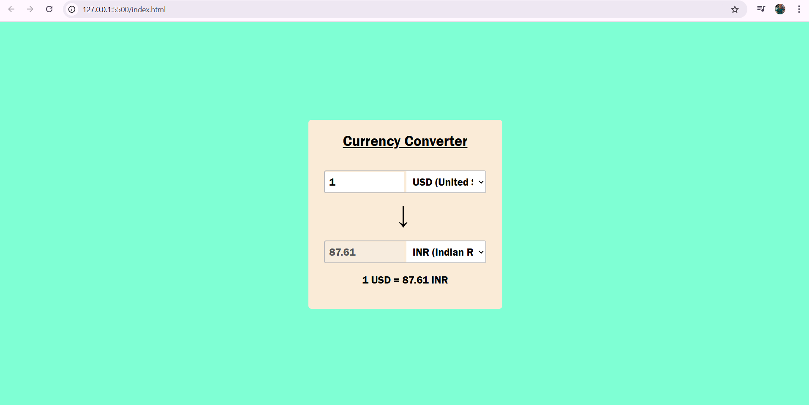

# 💱 Currency Converter Web App

A responsive web application for real-time currency conversion using JavaScript, HTML, CSS, and the ExchangeRate API.

## 🌐 Features

- Convert between 20+ international currencies
- Real-time exchange rates via REST API
- Responsive design for desktop and mobile
- Instant result updates based on user input
- User-friendly and minimal interface

## 🚀 Technologies Used

- **HTML** – Structure of the web app  
- **CSS** – Styling and responsive layout  
- **JavaScript** – Logic for currency conversion  
- **REST API** – Live exchange rates from ExchangeRate-API  

## 📸 Screenshot

 <!-- Add a real screenshot in your repo with this filename -->

